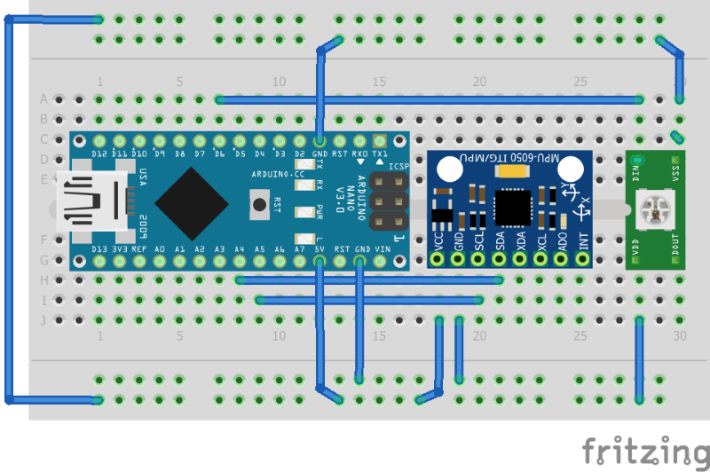

# BoxSack

## Hardware

* Arduino Nano
* WS2812B LED Strip  
* MPU6050 3-Axis Gyro & Accelerometer  

## Software

* Wire Library  
Used to read the acceleration from the MPU 6050 accelerometer

* FastLED Library  
Used to display the number of hits, or total power of all hits.  

* HighPass Filter  
Used to filter out gravity and slow swining of the boxsack

* LowPass Filter  
Used to smoothen the display

## Build Status  

Autmatic build using **arduino-cli**.

**CircleCi:**

